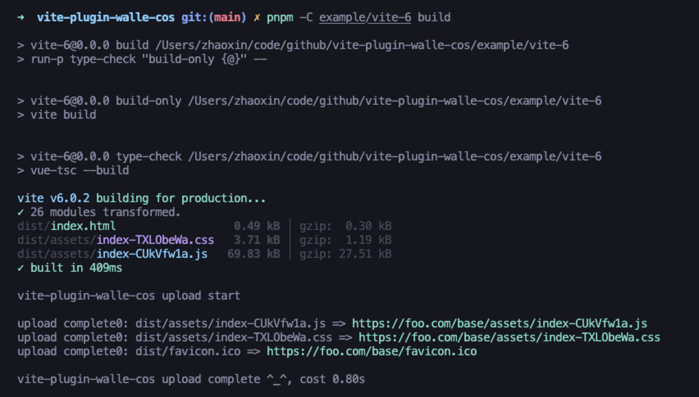

# vite-plugin-ali-oss


## 插件介绍

将项目中打包后生产文件上传到 Tencent COS，默认不上传 html。 模仿[vite-plugin-ali-oss](https://github.com/xiaweiss/vite-plugin-ali-oss) 实现

## 功能特性

- 默认跳过已存在的文件（不会下载文件），加快上传速度
- 几乎零配置，使用 `vite` `outDir` 路径，上传到 cos 的相同路径中

备注：除了所有 html 文件以外，上传所有文件。因为 html 文件没有哈希值，且通常放在服务器上

效果预览：



## 安装

适用 vite 5、vite 6 的 ESM 版本：

```bash
npm i -D vite-plugin-walle-cos@latest
```

## 基本使用

1. 在 vite.config.js 中注册本插件
2. 设置 base 开发或生产环境服务的公共基础 ***URL*** 路径

```javascript
import { defineConfig } from 'vite'
import vue from '@vitejs/plugin-vue'
import vitePluginWalleCos from 'vite-plugin-walle-cos'

const options = {
  region: '<Your Region>'
  SecretId: '<Your Access Key ID>',
  SecretKey: '<Your Access Key Secret>',
  bucket: '<Your Bucket>'
}

const prod = process.env.NODE_ENV === 'production'

// https://vitejs.dev/config/
export default defineConfig({
  base: prod ? 'https://foo.com/' : '/', // 打包时必须是 URL
  plugins: [vue(), vitePluginWalleCos(options)]
})
```

上传到 oss 特定目录下，只要直接设置 base：

```javascript
base: prod ? 'https://foo.com/yourpath/etc/' : '/'
```

3. 打包发布生产代码

```sh
pnpm run build
```

插件将会在打包完成后，上传 vite 配置 outDir 路径下的所有资源文件。

## 配置项

| options         | description                                             | type    | default       |
|-----------------|---------------------------------------------------------|---------|---------------|
| region          | Tencent COS 地域                                           | string  |               |
| SecretId     | Tencent COS 访问 ID                                        | string  |               |
| SecretKey | 阿里云 oss 访问密钥                                       | string  |               |
| bucket          | 阿里云 oss 存储空间名称                                    | string  |               |
| ignore          | 文件忽略规则。如果你使用空字符串 `''`，将不会忽略任何文件 | boolean | `'**/*.html'` |
| Timeout         | 超时时间，单位毫秒，默认为0，即不设置超时时间  | number  | 0             |
| test            | 仅测试路径，不会有文件上传                                  | boolean | false         |
| enabled         | 是否启用本插件                                            | boolean | true          |
| retry           | 上传失败时，重试次数                                       | number  | 0             |
| getAuthorization | 获取上传授权函数，详细信息请见 <https://cloud.tencent.com/document/product/436/8629> | function | () => ({}) |
